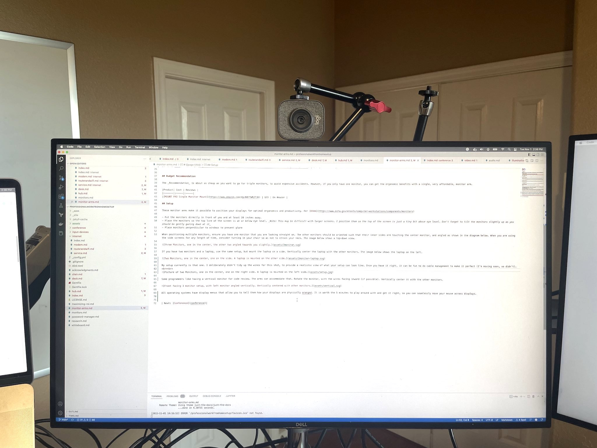
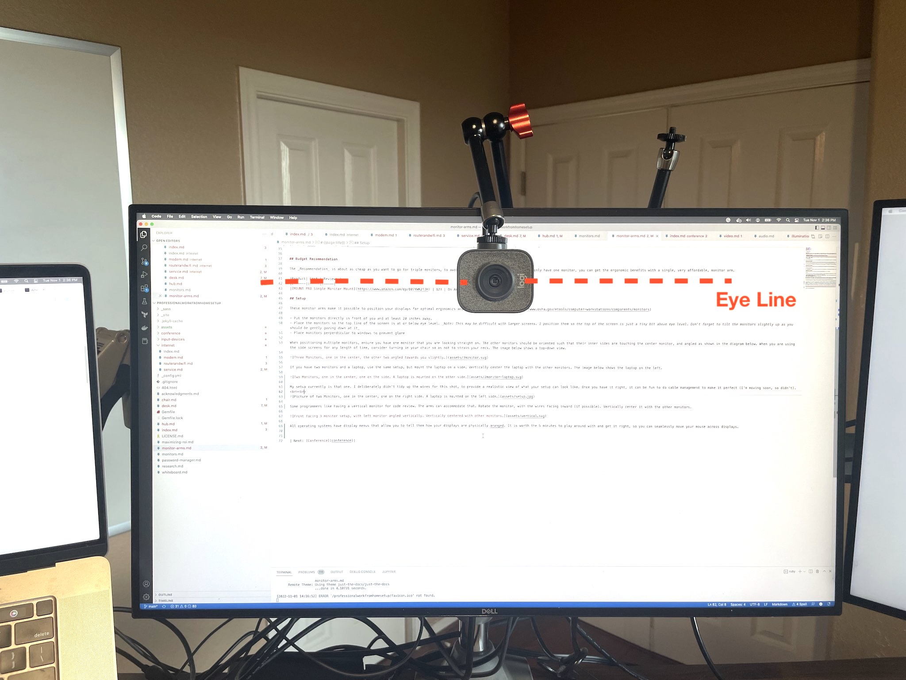

# {{page.title}}

## Criteria

The main criterion for a webcam is that it has good image quality. This goes way past resolution, to the quality of the lens and the automatic balancing algorithms. Both of the cameras included here have sufficient quality.

The second criterion is how much positioning control you have. Ideally, you will have the option to have your webcam level with the eyes of the person you are video conferencing with. This involves having the camera block a small portion of your center monitor. However this is unproductive for standard work and unnecessary for shorter meetings, so the camera should be able to default directly over the screen. To get this maneuverability, the camera must have a standard tripod mount, but ideally, be able to have the mount on top of the camera (rather than the standard bottom mount).

## Recommendation

The Logitech StreamCam is perfect for this purpose. An overall high-quality camera, it's also fantastically configurable. The mount can be easily detached and mounted on the top of the camera.

|Product| Cost | Reviews |
|:------|:-----|:-----|
|[Logitech StreamCam](https://www.amazon.com/Logitech-Streamcam-Streaming-YouTube-Graphite/dp/B07TZT4Q89/) | $130 | [Tom's Guide](https://www.tomsguide.com/reviews/logitech-streamcam) |

The mount should then be attached to this mounting arm. The arm has a clamp that can clamp onto the central post of the monitor arms.

|Product| Cost | Reviews |
|:------|:-----|:-----|
|[Mounting arm](https://www.amazon.com/gp/product/B08BNCWSRS) | $31 | On Amazon |

## Budget Recommendation

The budget recommendation is still a very good camera. The main thing it's missing is the ability to position it at eye level, which can be very important. With that said, this will still put you ahead of most remote programmers in terms of camera quality. This webcam clips to the top of your monitor, conforming to a good default configuration. You may be able to find a way to use the included tripod to position the camera for a better angle; however, without additional work, it's far lower than ideal.

|Product| Cost | Reviews |
|:------|:-----|:-----|
|[Logitech C922](https://www.amazon.com/Logitech-Stream-Streaming-Recording-Included/dp/B01MTTMPKT) | $75 | [Tom's Guide](https://www.tomsguide.com/reviews/logitech-c922-pro-webcam) |

If at all possible, I would use the _Recommendation_ for this one, as it isn't significantly more expensive.

## Setup

For the Logitech C922, mount it above the monitor. 

For the Logitech StreamCam, keep it mounted above the monitor during normal operations.

For one-on-one meetings or others where you are expecting to actively participate, use the arm to place the camera at or slightly below your eye level on the screen. Place your video conferencing application to ideally line up the eyes of the speaker with the webcam. It doesn't need to be perfect.

  

| Next: [Conference Illumination](illumination)|