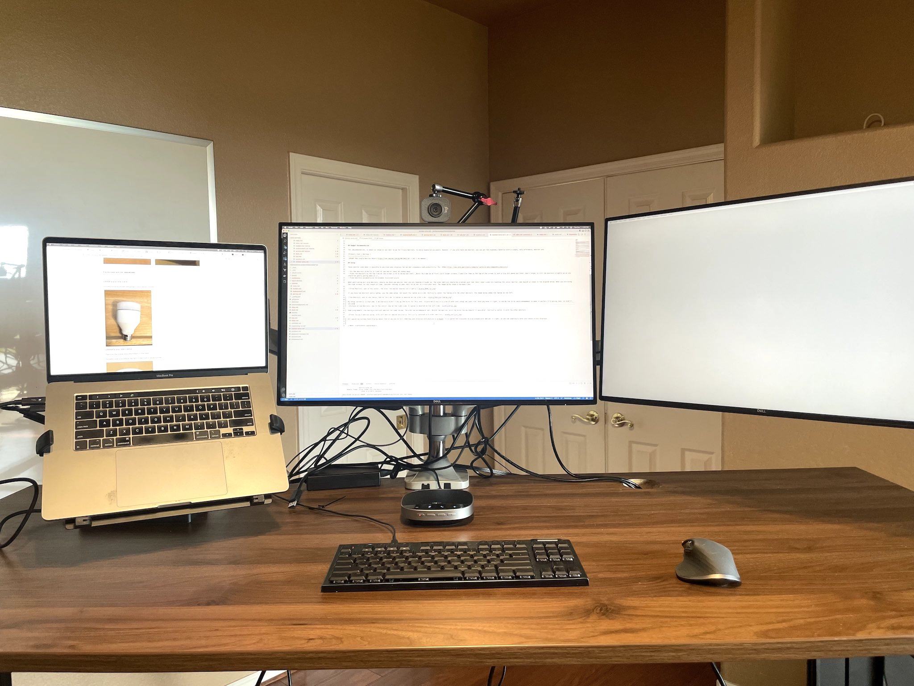

# {{page.title}}
[Supporting Research](research#large--multiple-monitors)

## Criteria
When selecting a monitor arm, the first question is: how many monitors do I need? The answer is at least 2, ideally 3. However, some older laptops cannot easily drive 3 monitors. Even if you only have 2 monitors, I recommend getting a 3-monitor arm so your primary monitor can be facing you straight on. Many 2-monitor products are not set up to give you that center screen. Additionally, if you have a laptop, you can buy a laptop tray to mount it one on of the side arms.

The quality criteria are:
- Adjustable Gas Springs: To allow precise but flexible positioning of monitors.
- VESA Mounts: Should support 75x75 and 100x100 to ensure any monitor can be mounted.

This is a product category where the vast majority of products are sold through obscure brands pretty much direct from factories. However, the quality level of these arms is surprisingly good. It's probably not worth exploring more expensive products unless you have specific aesthetic needs.

## Recommendation

This is the product model I use. It's very adjustable and has basic cable management integrated. The double-size clamp is critical to ensure the stability of a larger setup.

|Product| Cost | Reviews |
|:------|:-----|:-----|
|[WALI Triple Monitor Mount](https://www.amazon.com/WALI-Premium-Adjustable-Capacity-GSDM003/dp/B0875R16C2) | $110 | On Amazon |

It can be a bit intimidating when you take it out of the box, but it's surprisingly easy to install.

It can work well with a laptop tray, which allows you to use your laptop as a side screen at the correct height. This one supports up to 17" laptops.

|Product| Cost | Reviews |
|:------|:-----|:-----|
|[Laptop Vesa Mount Tray](https://www.amazon.com/MANHATTAN-Universal-Notebook-Holder-461498/dp/B075QBJM1X/) | $23 | On Amazon |

## Budget Recommendation

The _Recommendation_ is about as cheap as you want to go for triple monitors, to avoid expensive accidents. However, if you only have one monitor, you can get the ergonomic benefits with a single, very affordable, monitor arm.

|Product| Cost | Reviews |
|:------|:-----|:-----|
|[MOUNT PRO Single Monitor Mount](https://www.amazon.com/dp/B07YWK2TJH) | $23 | On Amazon |

## Setup

These monitor arms make it possible to position your displays for optimal ergonomics and productivity. Per [OSHA](https://www.osha.gov/etools/computer-workstations/components/monitors):

- Put the monitors directly in front of you and at least 20 inches away.
- Place the monitors so the top line of the screen is at or below eye level. _Note: This can be difficult with larger screens, so I position them with the top of the screen just a tiny bit above eye level. Don't forget to tilt the monitors slightly up as you should be gently gazing down at them._
- Place monitors perpendicular to windows to prevent glare.

When positioning multiple monitors, ensure you have one monitor that you are looking at straight on. The other monitors should be oriented such that their inner sides are touching the center monitor, and angled as shown in the diagram below. When you are using the side screens for any length of time, consider turning in your chair so as not to strain your neck. The image below shows a top-down view.

If you have two monitors and a laptop, use the same setup, but mount the laptop on a side. Vertically center the laptop with the other monitors. The image below shows the laptop on the left.

My setup currently is that one. To provide a realistic view of what your setup can look like, I deliberately didn't tidy up the wires for this shot. Once you have it right, it can be fun to do cable management to make it perfect, unlike mine here.
  

Some programmers like having a vertical monitor for code review. The arms can accommodate that. Rotate the monitor, with the wires facing inward (if possible). Vertically center it with the other monitors.

All operating systems have display menus that allow you to tell them how your displays are physically arranged. It is worth the 5 minutes to set it up so you can seamlessly move your mouse across displays.

| Next: [Conference](conference)|